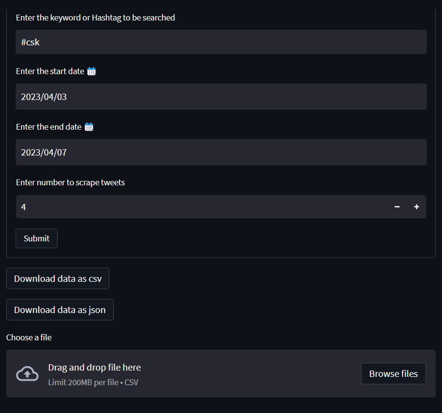

# Twitter Scraping with scraping tool Snscrape API

The project is to Scrape the data from the social networking site Twitter using **Snscrape API**

We can fetch data like tweets id,username,url,date etc and here in this project to do that we use *Snscrape API*

The Sncrape API does not come with any scraping limits and there is no need of creating an account to scrape like some twitters APIs do ask for account creation


## Installation *[tools,libraries]*
```bash
# Install Snscrape developer version  
  !pip3 install git+https://github.com/JustAnotherArchivist/snscrape.git

# Install streamlit for GUI
  pip3 install streamlit
  
# Install Pymongo for database connection
  pip3 install Pymongo
  pip3 install mongosh
```
## Import libraries and packages
```bash
import streamlit as st
import pandas as pd
import datetime
import time
import snscrape.modules.twitter as sntwitter
import pandas as pd
import pymongo
from pymongo import MongoClient
from datetime import datetime
```
## Functional Blocks Created
```bash
# 1. submit button function
         st_submit_form()

# 2. function to create a dataframe from scraped tweets list
         tw_list_to_df()

# 3. function to convert dataframe to csv
         convert_df(df)

# 4. function to convert dataframe to json
         convert_df_json(df)

```
## Project Overview
```bash
# STREAMLIT APP

•	Enter Keyword or hashtag as text
•	Select Start date with date picker
•	Select end date with date picker
•	Enter number to fetch number of tweets
•	Submit the form
•	Store the data in the mongodb

# MONGODB

•	Create two databases in mongodb with collections
•	One to store the data we scrape and submit in streamlit app
•	One to store the data that is uploaded through File Uploader from the streamlit app

# PYTHON CODE TO HANDLE STREAMLIT APP AND MONGODB

•	Create code for the stremalit widgets and buttons
•	Create code to download csv and json formats
•	Create code to upload csv format to mongodb
•	Create pymongo connections to mongodb
```
## Project Screenshots
```bash
# STREAMLIT APP

# MONGODB TWEETS DATABASE

```

## 🔗 References

[Snscrape](https://medium.com/dataseries/how-to-scrape-millions-of-tweets-using-snscrape-195ee3594721)

[Streamlit](https://docs.streamlit.io/)
